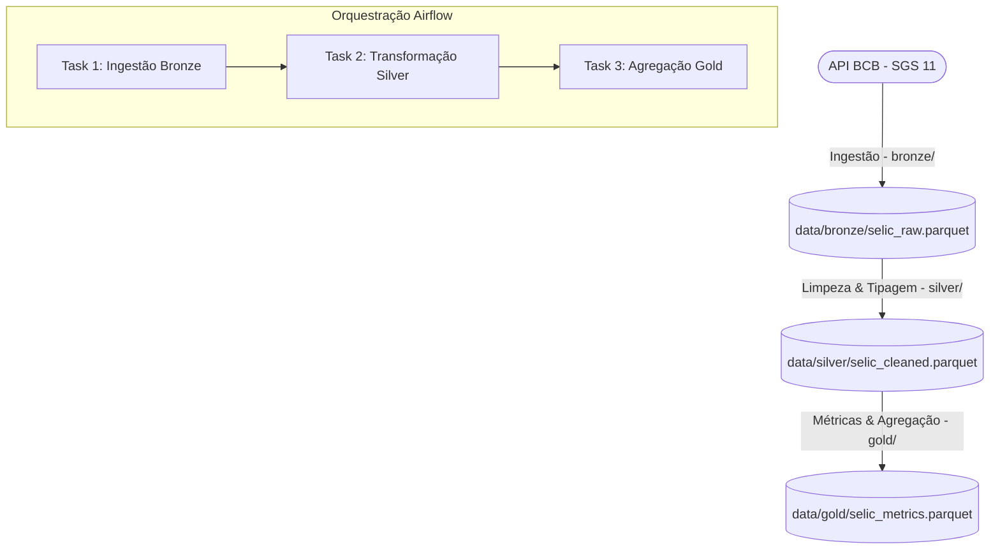

# Selic Rate Orchestration Pipeline (Banco Central do Brasil)

Este repositório contém a orquestração de um pipeline de dados utilizando o **Apache Airflow** para consumir dados históricos da Taxa Selic diária do **Banco Central do Brasil (SGS Série 11)**, para o período de **01/01/2020 a 31/12/2024**.

O projeto foi desenhado seguindo princípios de **Clean Code**, **SOLID**, **TDD (Test-Driven Development)**, **Arquitetura Hexagonal (Ports and Adapters)**, e conta com verificações rigorosas de **Qualidade de Dados** entre as camadas.

---

## Arquitetura do Projeto

O pipeline de dados é estruturado em três camadas clássicas de Data Lakehouse (Bronze, Silver e Gold), isoladas de forma modular em pacotes Python independentes. Cada camada implementa sua própria Arquitetura Hexagonal para garantir desacoplamento absoluto entre regras de negócio e infraestrutura.



### Detalhamento das Camadas

1. **Bronze (Ingestion)**:
   - **Responsabilidade**: Consome a API do Banco Central e salva os dados brutos exatamente como retornados.
   - **Formato**: Parquet (`data/bronze/selic_raw.parquet`).
   - **Qualidade de Dados**: Garante que o retorno da API não esteja vazio e que a persistência em disco ocorreu corretamente.
   
2. **Silver (Transformation)**:
   - **Responsabilidade**: Realiza a limpeza e a tipagem dos dados.
   - **Transformações**:
     - Conversão do campo `data` de `dd/MM/aaaa` para data nativa `datetime64[ns]`.
     - Conversão de `valor` (string decimal contendo a taxa diária) para numérico `float64`.
     - Remoção de nulos (`dropna`) e exclusão de duplicidades de datas (`drop_duplicates`).
     - Ordenação cronológica.
   - **Formato**: Parquet (`data/silver/selic_cleaned.parquet`).
   - **Qualidade de Dados**: Garante que nenhuma linha nula persista, valida o formato das datas e as faixas de valores de taxa Selic diária (emite avisos/warnings caso alguma taxa diária esteja fora dos limites normais de mercado, ex: valores negativos ou acima de 1% ao dia).

3. **Gold (Aggregation)**:
   - **Responsabilidade**: Consolidação e geração de métricas analíticas prontas para consumo de BI ou modelos.
   - **Métricas Calculadas**:
     - **Média Mensal** (`media_mensal`): A média aritmética das taxas diárias em cada mês.
     - **Desvio Padrão Mensal** (`desvio_padrao_mensal`): Medida de volatilidade da taxa no mês.
     - **Variação Mensal** (`variacao_mensal`): Variação percentual sobre a média do mês anterior.
     - **Taxa Acumulada Anual** (`taxa_acumulada_anual`): Acumulação da taxa composta diária usando a fórmula oficial de juros compostos:
       $$\text{Taxa Acumulada (\%)} = \left[ \prod_{i=1}^{N} \left(1 + \frac{\text{taxa}_i}{100}\right) - 1 \right] \times 100$$
   - **Formato**: Parquet (`data/gold/selic_metrics.parquet`). Ambas as tabelas (mensal e acumulado anual) são compiladas em um único DataFrame consolidado (unidos pela chave do ano).
   - **Qualidade de Dados**: Assegura que médias estejam dentro dos limites de taxas reais de mercado (entre 0% e 50% mensal) e rejeita qualquer dado nulo ou inconsistente.

---

## Estrutura de Pastas (Arquitetura Hexagonal)

Cada pacote (`bronze/`, `silver/`, `gold/`) está estruturado da seguinte forma:

```
[camada]/
├── domain/            # Modelos e regras puras de negócio (Dataclasses)
├── ports/             # Interfaces que delimitam as fronteiras
│   ├── input_ports.py    # Interfaces de entrada (Use Cases executados pelo orquestrador/main)
│   └── output_ports.py   # Interfaces de saída (Storage, API Reader, API Writer)
├── adapters/          # Implementações concretas de infraestrutura
│   ├── bcb_api_adapter.py      # Chamada HTTP à API
│   ├── parquet_reader_adapter.py # Leitura de arquivos Parquet locais
│   └── parquet_writer_adapter.py # Escrita de arquivos Parquet locais
├── services/          # Orquestrador do fluxo da camada (Usecase Implementation)
│   └── *_service.py            # Executa os adapters através das portas e checa qualidade
├── tests/             # Suíte de testes unitários (TDD)
│   ├── test_[camada]_adapters.py
│   └── test_[camada]_[fluxo].py
├── main.py            # Ponto de entrada executável da camada
```

Esta arquitetura segue o **SOLID**:
- **Single Responsibility Principle (SRP)**: Cada adapter e service faz apenas uma coisa.
- **Open-Closed Principle (OCP)**: Adapters e constructors aceitam configurações dinâmicas de diretório de saída ou caminhos específicos de arquivos, mantendo compatibilidade com as execuções antigas.
- **Dependency Inversion Principle (DIP)**: O `IngestService` depende de abstrações (`SelicSourcePort`, `RawStoragePort`), não de implementações de APIs ou sistemas de arquivos concretos.

---

## Como Executar Localmente

### 1. Requisitos Prévios
- Python 3.10 ou superior
- Docker e Docker Compose

### 2. Configurar o Ambiente Virtual Python
Crie e ative o ambiente virtual para instalar as dependências e executar os testes:

```bash
# Criar o ambiente virtual
python3 -m venv venv

# Ativar no Linux/Mac
source venv/bin/activate

# Atualizar o pip e instalar os pacotes
pip install --upgrade pip
pip install -r requirements.txt
```

### 3. Rodando os Testes Unitários e Linter (TDD)
Os testes cobrem todas as regras de transformação, cálculos matemáticos compostos de juros, tratamento de exceções e persistência de dados.

```bash
# Executa todos os testes
PYTHONPATH=. pytest

# Executa o linter flake8
flake8 bronze silver gold scripts tests
```

### 4. Executando as Camadas Manualmente via CLI
Você pode rodar as camadas sequencialmente utilizando os pontos de entrada no diretório `/scripts`:

```bash
# Ingestão Bronze
PYTHONPATH=. python scripts/bronze.py "01/01/2020" "31/12/2024" "data/bronze/selic_raw.parquet"

# Transformação Silver
PYTHONPATH=. python scripts/silver.py "data/bronze/selic_raw.parquet" "data/silver/selic_cleaned.parquet"

# Agregação Gold
PYTHONPATH=. python scripts/gold.py "data/silver/selic_cleaned.parquet" "data/gold/selic_metrics.parquet"
```

Os arquivos serão salvos em:
- `data/bronze/selic_raw.parquet`
- `data/silver/selic_cleaned.parquet`
- `data/gold/selic_metrics.parquet`

---

## 🐳 Executando o Airflow via Docker Compose

A infraestrutura do Airflow é orquestrada de forma isolada em containers Docker Compose utilizando um banco PostgreSQL como metastore de metadados.

### 1. Preparar o Arquivo `.env`
Defina o `AIRFLOW_UID` para evitar problemas de permissões com a pasta mapeada de dados no host:

```bash
echo "AIRFLOW_UID=$(id -u)" > .env
```

### 2. Inicializar os Serviços do Docker Compose
Execute o comando a seguir para subir os containers (Postgres, Webserver e Scheduler):

```bash
docker compose up -d
```

### 3. Acessar a Interface do Airflow
1. Abra o navegador em: [http://localhost:8080](http://localhost:8080)
2. Faça login utilizando o usuário admin padrão:
   - **Usuário**: `admin`
   - **Senha**: `admin`
3. Ative a DAG `dag_selic_medallion` e execute-a clicando no ícone de play (**Trigger DAG**).

### 4. Finalizar o Ambiente
Para parar os containers e limpar os recursos:

```bash
docker compose down
```

---

## ⚙️ CI/CD Pipeline (GitHub Actions)

O pipeline de Integração Contínua está configurado no arquivo `.github/workflows/ci-cd-pipeline.yml` e roda em cada push ou pull request na `main` e `develop`:
1. Instala o ambiente e as dependências de desenvolvimento.
2. Roda o **linter (flake8)** para garantir que as diretrizes do PEP-8 sejam obedecidas.
3. Roda a suíte de **testes unitários (pytest)** para validar se as transformações e tipos de dados de todas as camadas estão corretos.
